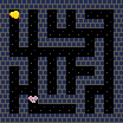
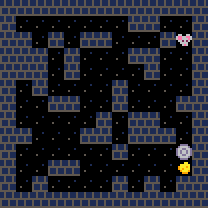
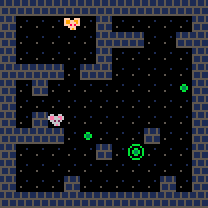
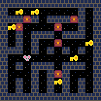
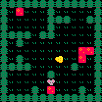
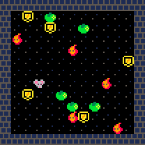

`jaxgmg`: JAX-accelerated Goal MisGeneralisation
================================================

JAX-based environments and RL baselines for studying goal misgeneralisation.


JAX-accelerated environments
----------------------------

The following environments are provided.

| Environment name     | Example | Description |
| -------------------- | ------- | ----------- |
| Cheese in the Corner |  | Navigate a mouse through a maze looking for cheese. During training, the cheese is in or near the top corner. |
| Cheese on a Dish |  | Navigate a mouse through a maze looking for cheese. During training, the cheese is on or near a dish. |
| Follow Me |  | Navigate a mouse around a maze to a sequence of beacons. During training, an expert reliably leads the way. |
| Keys and Chests |  | Navigate a mouse around a maze unlocking chests with keys. During training, keys are very sparse (not shown). |
| Lava Land |  | Navigate a mouse through a forest world looking for cheese. During training, lava tiles are rare (not shown). |
| Monster World |  | Navigate a mouse around an arena looking for apples while dodging monsters. Pick up shields to defeat monsters. During training, there is only time to avoid monsters (not shown). |


TODO: speedtests.


RL baselines
------------

TODO: implement baselines.


Procedural level generation
---------------------------

TODO: demo gifs.

TODO: speedtests.


Installation
------------

Install the latest master version from GitHub:

```
pip install git+ssh://git@github.com/matomatical/jaxgmg.git
```

Install from a local clone:

```
git clone git@github.com:matomatical/jaxgmg.git
cd jaxgmg
pip install -e .
```

TODO: list on PyPI


Explore the library
-------------------

After installing run the following:

```
jaxgmg --help
```

You can try the various subcommands to see demonstrations of the library's
functionality. For example:

* To play with an interactive demonstration of the environments, try
  `jaxgmg play ENV_NAME` (see `jaxgmg play --help` for options).
* To procedurally generate mazes , try `jaxgmg mazegen LAYOUT` (see `jaxgmg
  mazegen --help` for options).

Note: Most of the demos display colour images to the terminal using ANSI
control codes, which may not work in some environments (e.g. on Windows?).


Roadmap: Towards jaxgmg 1.0
---------------------------

Procedural generation methods:

* [x] Kruskal's algorithm
* [x] Random block mazes
* [x] Perlin noise and fractal noise

Environments (JAX accelerated):

* [x] Cheese in the corner
* [x] Keys and chests
* [x] Monster world
* [x] Cheese on a dish
* [x] Lava land
* [x] Follow the leader (simplified 'cultural transmission')
* [ ] Forest recovery

Environment features:

* [x] Boolean rendering
* [x] 8x8 RGB rendering
* [ ] Rendering in other resolutions
* [ ] Partially observable versions
* [ ] Gymnax API wrappers and registration

RL baselines:

* [ ] Train PPO agents in the above environments (symbolic)
* [ ] Train PPO agents in the above environments (small pixels)
* [ ] Qualitative and quantitative demonstration of goal misgeneralisation

Packaging:

* [x] Create this repository
* [x] Format project as an installable Python package
* [x] CLI easily demonstrating core features
* [ ] GIF animation of core environments
* [ ] Speedtests of generation methods, environments, baselines
* [ ] Document speedtests and RL experiments in a report
* [ ] Release jaxgmg v1 on arXiv and PyPI...!


Stretch roadmap: Towards jaxgmg 2.0
-----------------------------------

More procedural generation methods (see notes
[here](https://christianjmills.com/posts/procedural-map-generation-techniques-notes/):
  
* [ ] Rooms?
* [ ] BSP?
* [ ] Tunnellers?
* [ ] Cellular automata?
* [ ] Drunkard's walk?


More environments:

* [ ] Coin at the end (simplified 'coinrun'-style platformer)
* [ ] Survivor ('crafter'-style mining/farming grid world)
* [ ] Dungeon (a simple roguelike)
* [ ] More games inspired by Procgen


More environment features:

* [ ] Procgen-style variable-size mazes
* [ ] Procgen-style sprite and background diversity


More RL baselines:

* [ ] Train PPO agents in the stretch environments (symbolic and pixels)
* [ ] Train DQN agents in all environments (symbolic and pixels)

