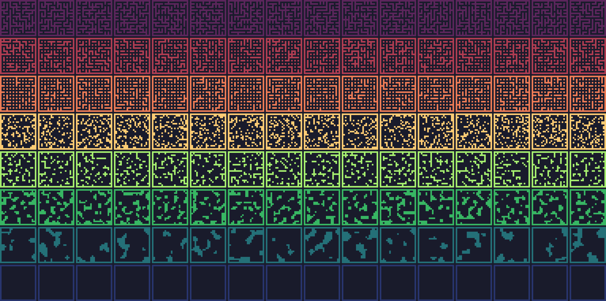

`jaxgmg`: JAX-accelerated Goal MisGeneralisation
================================================

JAX-based environments (WIP) and RL baselines (TODO) for studying goal
misgeneralisation.


Installation
------------

Install the latest master version from GitHub:

```
pip install git+ssh://git@github.com/matomatical/jaxgmg.git
```

Install from a local clone:

```
git clone git@github.com:matomatical/jaxgmg.git
cd jaxgmg
pip install -e .
```

TODO: list on PyPI


Explore the library
-------------------

After installing run the following:

```
jaxgmg --help
```

You can try the various subcommands to see demonstrations of the library's
functionality. For example:

* To play with an interactive demonstration of the environments, try
  `jaxgmg play ENV_NAME` (see `jaxgmg play --help` for options).
* To procedurally generate mazes , try `jaxgmg mazegen LAYOUT` (see `jaxgmg
  mazegen --help` for options).

Note: Most of the demos display colour images to the terminal using ANSI
control codes, which may not work in some environments (e.g. on Windows?).


JAX-accelerated environments
----------------------------

The following environments are provided.

<table>
  <thead><tr>
    <th>Name</th>
    <th>Example</th>
    <th>Description</th>
  </tr></thead>
  <tbody>
    <tr>
      <td>Cheese in the Corner</td>
      <td>
        
      </td>
      <td>
        A mouse navigates through a maze looking for cheese (positive
        reward).
        <br>
        When restricting to levels where the cheese always spawns in the top
        left corner, navigating to that corner becomes a viable proxy.
      </td>
    </tr>
    <tr>
      <td>Cheese on a Dish</td>
      <td>
        
      </td>
      <td>
        A mouse navigates through a maze looking for cheese (positive
        reward).
        <br>
        When restricting to levels where the cheese always spawns on or near
        a dish, navigating to the dish becomes a viable proxy.
      </td>
    </tr>
    <tr>
      <td>Follow Me</td>
      <td>
        
      </td>
      <td>
        A mouse navigates around a maze activating beacons in a specific
        sequence (positive reward). A second mouse is also navigating the
        maze in its own sequence.
        <br>
        When restricting to levels where the second mouse follows the beacons
        in the correct sequence, following the second mouse around becomes a
        viable proxy.
      </td>
    </tr>
    <tr>
      <td>Keys and Chests</td>
      <td>
        
      </td>
      <td>
        A mouse navigates around a maze collecting keys (zero reward) in
        order to unlock chests (positive reward).
        <br>
        When restricting to levels where keys are rare and chests are
        plentiful, intrinsically valuing keys and ignoring chests becomes a
        viable proxy.
      </td>
    </tr>
    <tr>
      <td>Lava Land</td>
      <td>
        
      </td>
      <td>
        A mouse navigates a forest world, avoiding lava tiles (negative
        reward) while looking for cheese (positive reward).
        <br>
        When restricting to levels without lava, seeking cheese without
        avoiding lava becomes a viable proxy.
      </td>
    </tr>
    <tr>
      <td>Monster World</td>
      <td>
        
      </td>
      <td>
        A mouse navigates around an arena looking for apples (positive
        reward) while dodging monsters (negative reward). The mouse picks up
        shields to defeat monsters.
        <br>
        When restricting to short episodes, avoiding monsters and ignoring
        apples becomes a viable proxy.
      </td>
    </tr>
  </tbody>
</table>

*Animations in this table produced with `jaxgmg play ENV_NAME`. The actions
are chosen by a human.*

TODO: speedtests.


Procedural level generation
---------------------------

Each environment supports a wide distribution of 'levels', and the library
includes easily configurable tools for procedural level generation.

At the core of these level generators is a suite of configurable procedural
maze generation methods, some outputs of which are depicted in the below
mural. There are currently five maze generation methods, any of which can be
paired with any of the above environment.

* **Tree mazes:** acyclic mazes based on spanning trees of a grid
  graph, generated using Kruskal's random spanning tree algorithm
    (Mural row 1).
* **Edge mazes:** a grid maze where each edge is independently determined to
  be traversable with configurable probability
    (Mural rows 2 and 3, edge probabilities 75% and 85% respectively).
* **Block mazes:** wherein each cell is determined to have a block/wall
  independently with configurable probability
    (Mural row 4, block probability 25%).
* **Noise mazes:** based on thresholding Perlin noise (or associated fractal
  noise) with a gradient grid of configurable cell size
    (Rows 5, 6, and 7, respectively with gradient cell size 2, 3, and 8; row
    8 depicts fractal noise with three octaves which just means we
    superimposed Perlin noise with cell sizes 4 and 2 onto the base noise
    with cell size 8).
* **Open mazes:** an empty maze with no obstacles and no procedural variation
    (row 8).
  This case is trivial, nevertheless it is useful in some cases such as
  testing RL algorithms and as a starting point for RL algorithms that build
  their own maze layouts.



*Mural produced with `jaxgmg mazegen mural --num_cols=16`*

Given a generator configuration and a target maze size, these maze generation
algorithms are fully acceleratable with JAX.
The following tables report rates of maze generation (mazes per second) for
different configurations and hardware.

On a M2 Macbook Air (without Metal):

| Generator                    | 13x13 mazes  | 25x25 mazes  | 49x49 mazes  |
| ---------------------------- | ------------ | ------------ | ------------ |
| Tree                         |  119K (430)  | 22.0K (41)   | 4.56K (16)   |
| Tree (alt. Kruskal impl.)    | 90.4K (300)  | 13.6K (25)   | 860 (1.5)    |
| Edges                        | 1.55M (17K)  | 389K (13K)   | 108K (4.7K)  |
| Blocks                       |  963K (12K)  | 221K (11K)   | 106K (1.2K)  |
| Noise (2x2 cells)            |  651K (5.0K) | 141K (970)   | 37.4K (130)  |
| Noise (8x8 cells)            | 1.08M (10K)  | 366K (4.6K)  | 82.9K (920)  |
| Noise (8x8 cells, 3 octaves) |  244K (1.5K) |  78K (160)   | 19.9K (61)   |
| Open                         | 13.8M (592K) | 7.22M (340K) | 2.10M (720K) |

TODO: test on a GPU.

*Rates collected with `jaxgmg speedtest`, batch size 32, 512 iterations per
trial, mean and standard deviation calculated after discarding the first
trial since that includes the compilation step.*


Maze solving
------------

Some environments (Follow Me, Monster World) don't just require a maze
layout, they have transition dynamics ('NPCs') that depend on optimal
navigation within the arbitrary generated layout.
This library's solution is to compute all-pairs shortest path information
during level generation and cache this navigation information as part of the
level struct for quick use during rollouts.
Caching the 'solution' to a maze layout at level generation time should be
faster overall than running a shortest path algorithm during each step, but
we still want level generation to be accelerated, so we need a
JAX-accelerated all-pairs shortest path algorithm.

The module `jaxgmg.procgen.maze_solving` provides a JAX-accelerated all-pairs
shortest path algorithm, with methods returning a tensor that encodes the
distance or optimal direction to move from any source node to any destination
node. The following is a visualisation of the result for a tree maze (the
algorithms work for arbitrary maze layouts).


How to read:
  The square in the 'macromaze' represents the source and the square in the
  'micromaze' (the maze within that square) represents the shortest path
  distance (left) or optimal direction (right) to reach that square from
  this source.
For the shortest path distances (left) the colour indicates the distance:
  ,
  ,
  ,
  .
For the optimal directions (right) the colour indicates the direction:
  ,
  ,
  ,
  ,
  .

*Visualisation generated with `jaxgmg mazesoln distance-direction`.*

TODO: speedtest

Level solving
-------------

TODO: Some environments also support optimal or heuristic policies (using
these same maze solving methods).

RL baselines
------------

TODO: implement baselines.


Roadmap: Towards jaxgmg 1.0
---------------------------

Procedural generation methods:

* [x] Kruskal's algorithm
* [x] Random block mazes
* [x] Perlin noise and fractal noise

Environments (JAX accelerated):

* [x] Cheese in the corner
* [x] Keys and chests
* [x] Monster world
* [x] Cheese on a dish
* [x] Lava land
* [x] Follow the leader (simplified 'cultural transmission')
* [ ] Forest recovery

Environment features:

* [x] Boolean rendering
* [x] 8x8 RGB rendering
* [ ] Rendering in other resolutions
* [ ] Partially observable versions
* [ ] Gymnax API wrappers and registration

RL baselines:

* [ ] Train PPO agents in the above environments (symbolic)
* [ ] Train PPO agents in the above environments (small pixels)
* [ ] Qualitative and quantitative demonstration of goal misgeneralisation

Packaging:

* [x] Create this repository
* [x] Format project as an installable Python package
* [x] CLI easily demonstrating core features
* [x] GIF animation of core environments
* [ ] Speedtests of generation methods, environments, baselines
* [ ] Document speedtests and RL experiments in a report
* [ ] Release jaxgmg v1 on arXiv and PyPI...!


Stretch roadmap: Towards jaxgmg 2.0
-----------------------------------

More procedural generation methods (see notes
[here](https://christianjmills.com/posts/procedural-map-generation-techniques-notes/)):
  
* [ ] Simple room placement?
* [ ] BSP?
* [ ] Tunnellers?
* [ ] Cellular automata?
* [ ] Drunkard's walk?


More environments:

* [ ] Coin at the end (simplified 'coinrun'-style platformer)
* [ ] Survivor ('crafter'-style mining/farming grid world)
* [ ] Dungeon (a simple roguelike)
* [ ] More games inspired by Procgen


More environment features:

* [ ] Procgen-style variable-size mazes
* [ ] Procgen-style sprite and background diversity


More RL baselines:

* [ ] Train PPO agents in the stretch environments (symbolic and pixels)
* [ ] Train DQN agents in all environments (symbolic and pixels)

